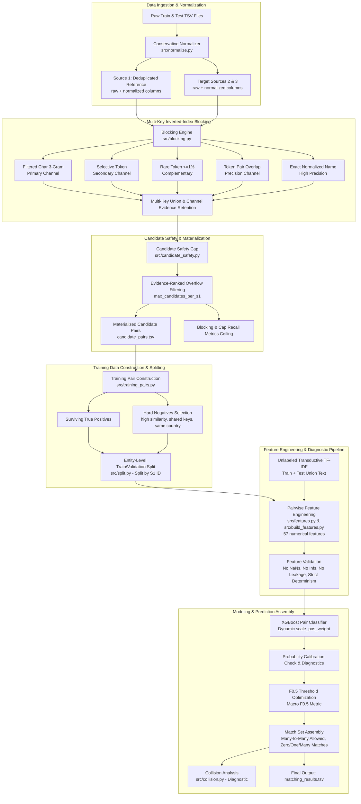

# Final End-to-End System Architecture

This document describes the complete, aligned production architecture for the Amazon ML Challenge 2026 Business Entity Resolution project.

## Architectural Guarantees
1. **Recall-First Blocking with Bound Candidate Budget:** Filtering high-frequency tokens and n-grams avoids Cartesian explosion, while the safety cap deterministically ranks candidates by evidence.
2. **Strict Entity-Level Isolation:** Train and validation sets are split strictly by Source 1 entity IDs to eliminate reference entity leakage.
3. **Evidence Preservation:** Every candidate pair carries bitflags for the channels through which it was generated (`num_blocking_keys`, `blocked_exact_name`, etc.), enriching the downstream classifier.
4. **Hard-Negative Training:** The model trains on challenging negative candidates that survived blocking, preventing trivial negatives from degrading discriminative precision.
5. **Transductive Unlabeled TF-IDF:** Fits vectorizers on the union of all raw names and addresses across train and test without labels, mitigating out-of-vocabulary drift across country sets.
6. **Macro F0.5 Optimization:** Tailored specifically to penalize precision errors heavily, honoring the competition evaluation.
